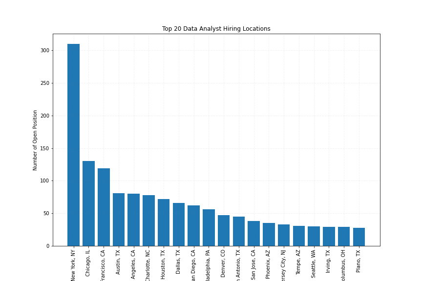

# Data-Analyst-Project-3

Background & General Info

It’s no secret that the novel coronavirus 2019 (COVID-19) outbreak is deeply affecting the lives of millions around the world, both directly and indirectly. The United States alone has shed nearly 10 million jobs in the past two weeks due to the COVID-19 shutdown.

However, surveys indicate that the data teams are long yet to see widespread layoffs or furloughs at this time, particularly among larger companies. So, strike at the jobs while it lasts?

We have created a website that precisely helps people look for data analyst jobs nationwide. Our website lets users get whole picture of data analysts job openings nationwide, including size of employer, location, industry and estimated salary range.

## Data sources:
For our website, we used that data analyst job postings dataset from Kaggle, which contains data of salary estimate, location, company rating, job description and more for job in the United States. Our dataset had more than 2000 rows and 16 columns. While going through our data we were able to decide that we will do visualizations around job opening by location, employer's size and estimated range of salary.

## Application:
Python (Jupyter Notebook, Pandas)
Flask (SQLAlchemy, psycopg2)
SQL/ PostgreSQL
JavaScript Libraries (Plotly, Leaflet)
HTML/ CSS
Excel

## DATA SET:
This data set is taken from Kaggle where and it is Scrapped from GlassDoor platform which is famous for it employment service and 
data has these features 
* Job Title
* Salary Estimate
* Job Description
* Rating
* Company Name
* Location
* Headquarters
* Size
* Founded
* Type of ownership
* Industry
* Sector
* Revenue
* Competitors
* Easy Apply
## DATA CLEANING:
In this stage of project i had cleaned data and made specific changes like 
* Simplified the **Job Title** into a smaller version of it.
* Made salary feature by removing these **Glassdoor Estimate** and **k or $** for fitting it to a mdoel.
* Took the length of the description instead of taking the description as the whole.
* Made **Level** feature to describe the seniority of the job position.
* Created **Min salary** and **Max salary** feature to better understand the data
* Created a Avg Salary feature which we will use in prediction.
* And made many more changes which can be viewed in the DA Cleaned data csv.
##  Exploratory Data Analysis(EDA):

Performed Exploratory Data Analysis on the cleaned data and got a lot of insights , few of them are 
<

## Webpage:

